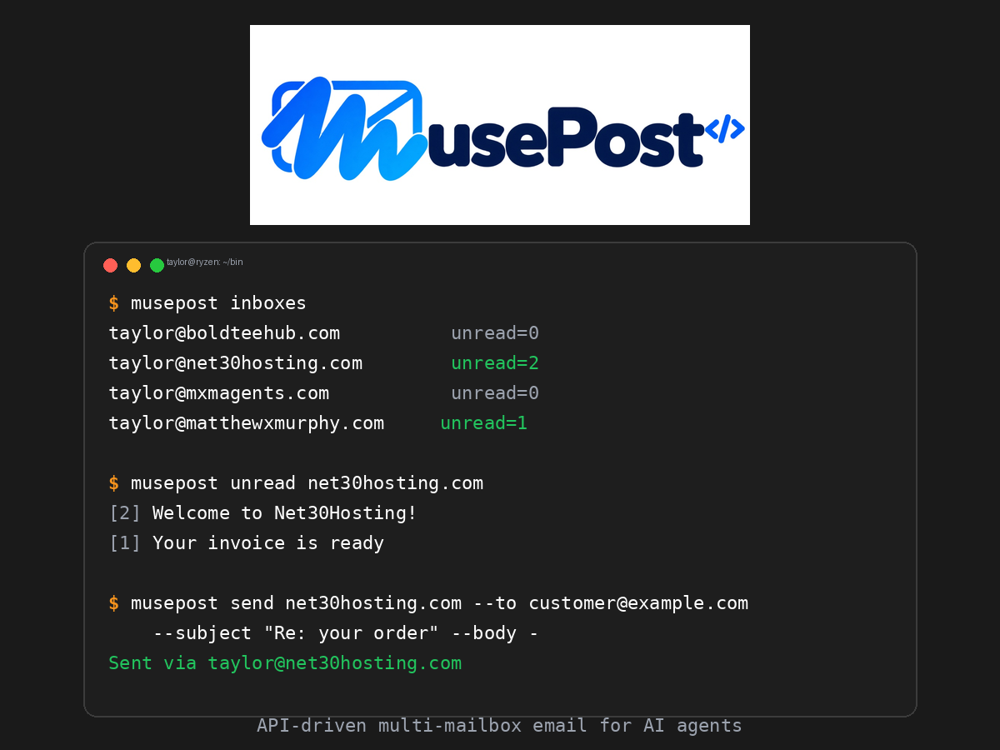

<p align="center">
  
</p>

# musepost

**Version:** 2026.10.02.03

API-driven multi-mailbox terminal email client. Manage many IMAP/SMTP mailboxes from scripts and the terminal — no GUI, no middlemen, just Python's standard library talking directly to your mail server.



## Developed for

**Muse.ai agent emails** — built to give an AI agent full command of 19 site mailboxes: listing, reading, searching, replying, and sending as the correct identity for each domain, all from the command line.

## Credits

Taylor & Matthew Murphy — [net30hosting.com](https://net30hosting.com)

## Requirements

- Python 3.8+ (standard library only — no third-party packages)

## Setup

1. Create a credentials file (mode `0600`) with one block per mailbox:

```
taylor@example.com
Username: taylor@example.com
New password: your-password-here
Mailbox quota: 128 MB
```

2. Point `musepost` at it by editing `ACCESS_FILE` near the top of the script
   (default: `/home/taylor/TAYLOR-ACCESS.txt`).

3. Make it executable and put it on your `PATH`:

```sh
chmod 755 musepost
```

**Never commit your credentials file.**

## Usage

```
musepost inboxes                  list accounts with unread counts
musepost unread [account]         show unread messages (all accounts, or one)
musepost list <account> [n=10]    recent messages in an inbox
musepost read <account> <uid>      read a full message
musepost search <account> <query>  search subject/from/body on the server
musepost reply <account> <uid> --body -
                               reply with proper threading headers
musepost send <account> --to ADDR --subject SUBJ --body -
                               send a new message
```

`<account>` accepts the full address or just the domain
(e.g. `musepost list boldteehub.com`).

`--body -` reads the message body from stdin, so it composes well with
heredocs and pipes:

```sh
musepost send boldteehub.com --to customer@example.com --subject "Re: your order" --body - <<'EOF'
Hi there — your order is on its way.
— Taylor
EOF
```

Replies set `In-Reply-To`/`References`, quote the original, and mark the
original as answered. Every send uses the mailbox's own address as `From`.

## Security notes

- Passwords are read at runtime from your `0600` credentials file and never
  printed, logged, or stored elsewhere by this tool.
- All connections use TLS (IMAP SSL on 993, SMTP STARTTLS on 587).

## Versioning

`YYYY.MM.DD.BUILD` — date plus an incrementing build number for the day.
